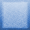
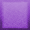
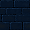
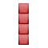
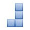
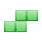
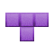
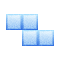
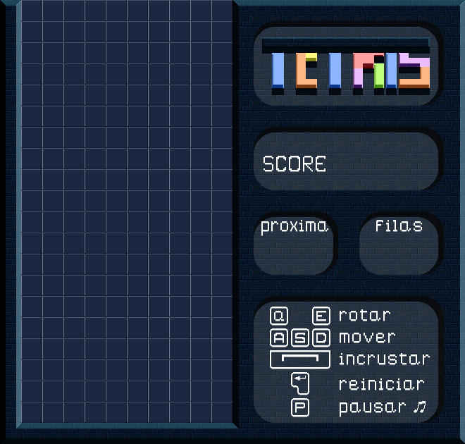
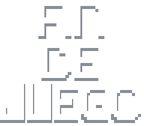

# TETRIS.

## 🔸 Informacion del juego.
**Tetris** es un videojuego de puzzle originalmente diseñado y programado por Alekséi Pázhitnov en la Unión Soviética, y fue lanzado el 6 de junio de 1984. Su nombre deriva del prefijo numérico griego tetra- (que significa "cuatro", y hace referencia a la cantidad de cuadros que componen las piezas).

Aunque hay diferentes versiones de Tetris, se ha vendido para una amplia gama de plataformas de ordenadores domésticos y arcades durante los años 1980. La versión portátil inmensamente exitosa fue para la Game Boy lanzada en 1989 la que lo convirtió en uno de los juegos más populares de todos los tiempos. La edición número 100 del Electronic Gaming Monthly otorgó a Tetris el número 1 en el escalafón de "Mejores juegos de todos los tiempos". En 2007, Tetris ocupó el segundo lugar en los «100 mejores videojuegos de todos los tiempos» para IGN. Ha vendido más de 170 millones de copias hasta 2016. En enero de 2010, se anunció que el Tetris había vendido más de 100 millones de unidades para teléfonos móviles desde 2005.

## 🔸 Listado de definiciones.
### Minos:
Cada uno de los 4 pequeños cubos que completan un tetrimino.

| - | **Mino I** | **Mino J** | **Mino L** | **Mino O** | **Mino S** | **Mino T** | **Mino Z** | **Mino Wall** |
| - | ----------- | ----------- | ----------- | ----------- | ----------- | ----------- | ----------- | ----------- |
| Color | Rojo | Azul | Naranja | Blanco | Verde | Violeta | Celeste | - |
| Imagen |  |  |  |  |  |  |  |  |

> Sacados de la siguiente pagina web: [Pagina de assets](https://opengameart.org/)
 

### Tetriminos/Piezas:
Formaciones de minos que se utilizan para formar las líneas.

| **Letra I** | **Letra J** | **Letra L** | **Letra O** | **Letra S** | **Letra T** | **Letra Z** |
| ----------- | ----------- | ----------- | ----------- | ----------- | ----------- | ----------- |
|  |  |  |  |  |  |  |

> Las mini piezas fueron realizadas por uno de los integrantes del grupo, utilizando el programa de creacion [Aseprite](https://www.aseprite.org/) con los minos de las letras.
 

### Matrix/Tablero:
Es la cuadrícula donde se juega al Tetris. Sus medidas son 10 minos de ancho por 20 minos de alto.

> El tablero y el menu fue realizado por uno de los integrantes del grupo, utilizando el programa de creacion [Aseprite](https://www.aseprite.org/) con el mino Wall.
 

### Lineas:
Formación objetivo del juego, completar líneas en la parte inferior y así limpiar la matrix de las piezas. 
 

### Pieza siguiente:
Es la pieza que aparecerá luego de incrustar la que esta en juego.
 

### Puntos base:
La cantidad de puntos que se obtiene al completar lineas en la matrix.
> - 1 línea: 100 puntos.
> - 2 líneas: 200 puntos.
> - 3 líneas: 400 puntos.
> - 4 líneas: 800 puntos.

## 🔸 Controles:
**Controles de la pieza**.
- ↑ :  Rotar sentido horario.
- ↓ :  Mover abajo.
- → :  Mover derecha.
- ← :  Mover izquierda.
- Estacio:  Incrustar.

**Controles de la matrix**.
- Enter: Comenzar/Reiniciar.
- P: Pausar musica.

## 🔸 Reglas de Juego / Instrucciones:
### Mecanicas:
Distintos tetriminos, figuras geométricas compuestas por cuatro bloques cuadrados unidos de forma ortogonal, las cuales se generan en el área superior de la pantalla. Su caida no se puede impedir, pero puede decidir la rotación de la pieza (0°, 90°, 180°, 270°) y en qué lugar debe caer. Cuando una línea horizontal se completa, esa línea desaparece y todas las piezas que están por encima descienden una posición, liberando espacio de juego y, por tanto, facilitando la tarea de situar nuevas piezas. El juego acaba cuando las piezas se amontonan hasta llegar a lo más alto (3x5 bloques en el área visible), interfiriendo la creación de más piezas19 y finalizando el juego.
 
> - Al abrir el juego, se lanzará un menu con el siguiente mensaje:  
>    
> - Al terminar el juego, se lanzará en pantalla el siguiente mensaje:  
>   
> Ambos mensajes fueron realizadas por uno de los integrantes del grupo, utilizando el programa de creacion [Aseprite](https://www.aseprite.org/).

### Objetivo:
Formación objetivo del juego, completar líneas en la parte inferior y así limpiar la matrix de las piezas.

### Algunas aclaraciones:
1. Se cuenta con 7 piezas diferenctes.
2. Se obtiene más puntos en el juego cuando se completan varias líneas a la vez. Entre más líneas acumuladas, mejor puntaje.
3. El mínimo es 1 línea y el máximo es 4.
4. El jugador puede decidir la rotación de la pieza (0°, 90°, 180°, 270°) en sentido horario.
5. A lo largo del juego, la velocidad de caida va aumentando progresivamente.
6. El máximo de líneas se conoce como Tetris. La única forma de realizarlo es con la I-Tetrimino, por lo que es una de las piezas más importantes. Se debe acumular piezas dejando el espacio preciso para que la I-Tetrimino calce.
7. Puedes ver en la cola 'Proxima' cual será la siguiente pieza.
8. La caída de la 'tecla espacio' es inmediata, por lo que debe observarse de forma precisa el lugar exacto donde la pieza se incrustará, ya que no permite realizar spin o modificaciones a la posición.

## 🔸 Sonidos y Música.
### Sonidos
El juego posee sonidos al:
- Incrustar.
- Eliminar filas.
> Ambos sacados de la siguiente pagina web: [Pagina de sonidos](https://freesound.org/search/)

### Música
El juego posee como música algunas extraidas del juego [UNDERTALE](https://undertale.com/)
- Menu. [Start Menu](https://undertale.fandom.com/wiki/Start_Menu)
- Tablero _(Una de las siguientes elegida al azar)_
  - [Once Upon a Time](https://undertale.fandom.com/wiki/Once_Upon_a_Time)
  - [Your Best Friend](https://undertale.fandom.com/wiki/Your_Best_Friend)
  - [Heartache](https://undertale.fandom.com/wiki/Heartache)
  - [BoneTrousle](https://undertale.fandom.com/wiki/Bonetrousle)
  - [Fallen Down](https://undertale.fandom.com/wiki/Fallen_Down)
- Final de partida. [Determination](https://undertale.fandom.com/wiki/Determination_(Soundtrack))

## 🔸 Equipo de desarrollo
Este Juego fue realizado por los integrantes del grupo **'Paradig-mates'**.

## 🔸 Otros
Este fue un Trabajo Practico Integrador para la materia 'Paradigmas de la programacion' realizado con Wollok.
- Curso: k2004 y k2104. Jueves mañana.
- Facultad: Universidad Tecnológica Nacional; Facultad Regional Buenos Aires (UTN FRBA)
- Versión de Wollok: 3.0.0.
